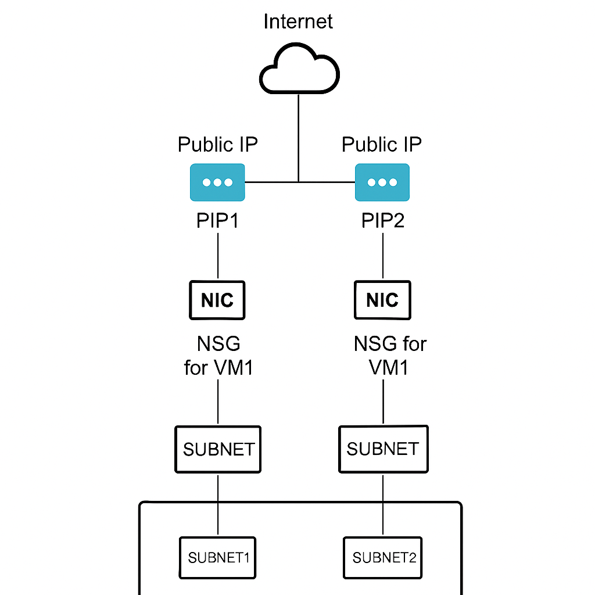

# Terraform Dynamic VM Deployment

This project demonstrates how to use Terraform to dynamically deploy virtual machines in Azure. The infrastructure as code (IaC) solution allows for flexible and repeatable VM deployments.

## Prerequisites

- [Terraform](https://www.terraform.io/downloads.html) (>= 1.0.0)
- [Azure CLI](https://docs.microsoft.com/en-us/cli/azure/install-azure-cli)
- Azure subscription
- Azure credentials configured

## Project Structure

```
terraform-dynamic-vm/
├── README.md
├── main.tf
├── variables.tf
├── outputs.tf
├── terraform.tfvars
└── modules/
    ├── network/
    │   ├── main.tf
    │   ├── variables.tf
    │   └── outputs.tf
    ├── storage/
    │   ├── main.tf
    │   ├── variables.tf
    │   └── outputs.tf
    └── compute/
        ├── main.tf
        ├── variables.tf
        └── outputs.tf
```

## Modules

### Network Module
Handles the creation of virtual networks, subnets, and network security groups.

### Storage Module
Manages storage accounts and disk configurations.

### Compute Module
Responsible for VM creation and configuration.

## Configuration

1. Initialize Terraform:
```bash
terraform init
```

2. Review the planned changes:
```bash
terraform plan
```

3. Apply the configuration:
```bash
terraform apply
```

## Clean Up

To remove all resources:
```bash
terraform destroy
```

## Contributing

1. Fork the repository
2. Create a feature branch
3. Submit a pull request

## License

This project is licensed under the MIT License.
# 🚀 Terraform: Dynamic Azure VM Deployment

This project provisions multiple Linux VMs on Microsoft Azure using a modular Terraform configuration. Each VM is deployed with its own Public IP, Network Interface, and Network Security Group (NSG) with custom inbound rules (ports 22, 80, 8080).

---

## 📸 Architecture Overview

```mermaid
graph TD
    Internet --> PIP1(Public IP - VM1)
    Internet --> PIP2(Public IP - VM2)

    PIP1 --> NIC1
    PIP2 --> NIC2

    NIC1 --> NSG1[NSG for VM1]
    NIC2 --> NSG2[NSG for VM2]

    NSG1 --> SUBNET1
    NSG2 --> SUBNET2

    SUBNET1 --> VNET
    SUBNET2 --> VNET

    VNET[VNet: demo-vnet]
Diagram: High-level representation of traffic flow from the internet to each VM over allowed ports (22, 80, 8080).
✨ Features
Multiple VMs with unique public IPs and NSGs

Open ports: 22 (SSH), 80 (HTTP), 8080 (App)

Modular design: network and VM modules

SSH key or password-based login

⚙️ Requirements
Terraform CLI v1.3+

Azure CLI logged in (az login)

SSH key (~/.ssh/id_rsa.pub) or admin password

🔧 Configuration (terraform.tfvars)
hcl
Copy
Edit
resource_group       = "demo-rg"
location             = "eastus"
vnet_name            = "demo-vnet"
address_space        = ["10.0.0.0/16"]
subnet_names         = ["subnet1", "subnet2"]
subnet_prefixes      = ["10.0.1.0/24", "10.0.2.0/24"]
vm_names             = ["vm1", "vm2"]
vm_sizes             = ["Standard_B2s", "Standard_B2ms"]
admin_username       = "azureuser"
admin_password       = "P@ssw0rd1234!"
ssh_public_key_path  = "~/.ssh/id_rsa.pub"
🚀 Usage
bash
Copy
Edit
terraform init                      # Initialize provider
terraform plan -var-file="terraform.tfvars"   # Review changes
terraform apply -var-file="terraform.tfvars"  # Deploy VMs
🔐 Security Considerations
Use source_address_prefix = "<YOUR-IP>/32" in NSG rules for secure SSH

Avoid using * (open to the world) in production

Never commit passwords or secrets to version control

🧹 Cleanup
To destroy all resources created:

bash
Copy
Edit
terraform destroy -var-file="terraform.tfvars"
🧩 Customization
Add more open ports in modules/vm/main.tf

Add auto-scaling, load balancers, or monitoring in modules

Use remote backend for shared state (e.g., Azure Storage Account)

📬 Feedback
For issues, suggestions, or improvements, open a GitHub issue or pull request.

📎 License
MIT © Emmanuel Luni




---

### 📁 Also Create the Directory and Placeholder Image File:

1. Create a directory for images:

```bash
mkdir -p terraform-dynamic-vm/images
Save your screenshot as:


Edit
terraform-dynamic-vm/images/azure-vm-ssh.png