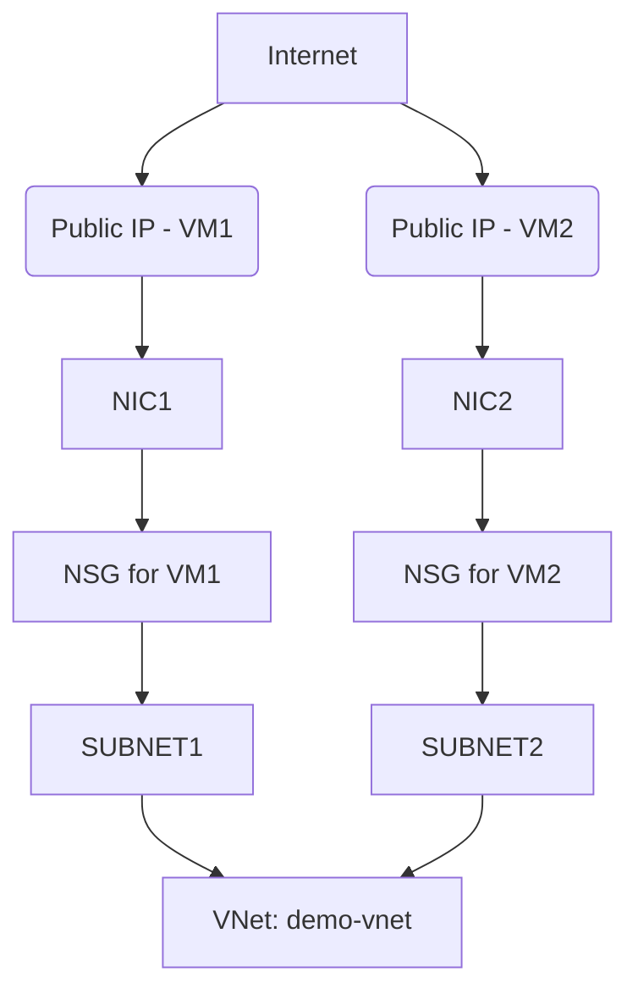

# Terraform Dynamic VM Deployment

This repository demonstrates the use of Terraform to deploy virtual machines dynamically in Azure. It leverages Infrastructure as Code (IaC) principles to ensure flexible and repeatable deployments.

## Prerequisites

To use this project, ensure you have the following:

- [Terraform](https://www.terraform.io/downloads.html) version 1.0.0 or higher.
- [Azure CLI](https://docs.microsoft.com/en-us/cli/azure/install-azure-cli) installed and configured.
- An active Azure subscription.
- Azure credentials set up for authentication.

## Project Structure

The project is organized as follows:

```
terraform-dynamic-vm/
├── README.md
├── main.tf
├── variables.tf
├── outputs.tf
├── terraform.tfvars
└── modules/
    ├── network/
    │   ├── main.tf
    │   ├── variables.tf
    │   └── outputs.tf
    ├── vm/
    │   ├── main.tf
    │   ├── variables.tf
    │   └── outputs.tf
```

## Bash Script for Project Setup

To set up the project structure, use the following bash script:

```bash
#!/bin/bash

# Define project root directory
ROOT_DIR="terraform-dynamic-vm"

# Define directories and files
declare -a DIRS=(
  "$ROOT_DIR/modules/network"
  "$ROOT_DIR/modules/vm"
)

declare -a FILES=(
  "$ROOT_DIR/main.tf"
  "$ROOT_DIR/variables.tf"
  "$ROOT_DIR/outputs.tf"
  "$ROOT_DIR/terraform.tfvars"
  "$ROOT_DIR/modules/network/main.tf"
  "$ROOT_DIR/modules/network/variables.tf"
  "$ROOT_DIR/modules/network/outputs.tf"
  "$ROOT_DIR/modules/vm/main.tf"
  "$ROOT_DIR/modules/vm/variables.tf"
  "$ROOT_DIR/modules/vm/outputs.tf"
)

# Create directories
for dir in "${DIRS[@]}"; do
  mkdir -p "$dir"
done

# Create files
for file in "${FILES[@]}"; do
  touch "$file"
done

echo "Terraform project structure created successfully!"

# Optional: Print directory structure
echo "Project Structure:"
tree "$ROOT_DIR"
```

Save this script as `create_dir.sh` and execute it to generate the required project structure.

## Modules Overview

### Network Module
This module provisions the virtual network, subnets, and network security groups (NSGs). It also associates NSGs with subnets.

### VM Module
This module handles the creation of virtual machines, public IPs, network interfaces, and NSG rules. Each VM is configured with SSH access and custom inbound rules for ports 22, 80, and 8080.

## Configuration Steps

1. **Initialize Terraform**:
   ```bash
   terraform init
   ```

2. **Review Planned Changes**:
   ```bash
   terraform plan
   ```

3. **Apply the Configuration**:
   ```bash
   terraform apply
   ```

## Cleanup

To destroy all resources created by this configuration, run:
```bash
terraform destroy
```

## Features

- Deploy multiple Linux VMs with unique public IPs and NSGs.
- Open ports for SSH (22), HTTP (80), and application traffic (8080).
- Modular design for network and VM provisioning.
- Support for SSH key-based or password-based login.

## Security Considerations

- Use `source_address_prefix = "<YOUR-IP>/32"` in NSG rules for secure SSH access.
- Avoid using `*` (open to the world) in production environments.
- Do not commit sensitive information like passwords or secrets to version control.

## Customization

- Add additional open ports in `modules/vm/main.tf`.
- Extend functionality with auto-scaling, load balancers, or monitoring.
- Use a remote backend for shared state (e.g., Azure Storage Account).

## Feedback and Contributions

For issues, suggestions, or improvements, feel free to open a GitHub issue or submit a pull request.

## License

This project is licensed under the MIT License.

## Architecture Diagram

Below is a high-level representation of the traffic flow from the internet to each VM over allowed ports:



## Placeholder Image File

To include screenshots or diagrams, create a directory for images:
```bash
mkdir -p terraform-dynamic-vm/images
```
Save your screenshot as:
```
terraform-dynamic-vm/images/azure-vm-ssh.png
```
